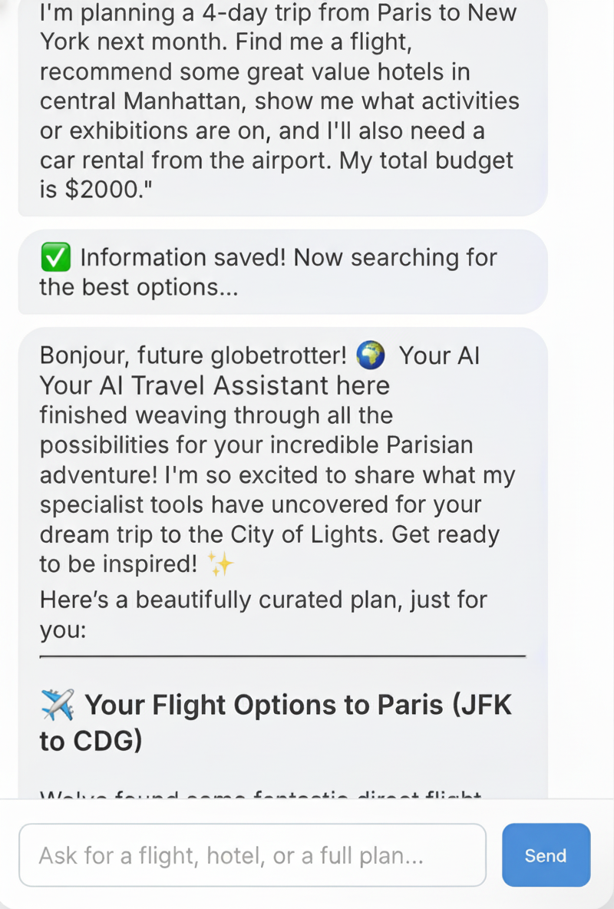

# Multi-Agent Travel Booking System

Production-ready LangGraph implementation for intelligent travel planning with multi-API integration, async execution, and human-in-the-loop workflows.


## 🎬 Demo

### Complex Trip Planning Example



**User Query:** "I'm planning a 4-day trip from Paris to New York..."

**System Response:**
- ✅ Triggers customer information form
- 🔄 Parallel API calls to Amadeus (flights, hotels, activities)
- 📦 Generates 3 budget-tiered packages
- 💬 Natural language presentation

## 🚀 Features

### Core Capabilities

- **Multi-Agent Architecture**: Specialized agents for flights, hotels, and activities
- **Async Parallel Execution**: Simultaneous API calls for optimal performance
- **Intelligent Analysis**: LLM-powered natural language understanding
- **Budget-Aware Planning**: Automatic package generation (Budget/Balanced/Premium)
- **Human-in-the-Loop**: Mid-conversation form collection for customer details

### API Integrations

- ✈️ **Amadeus**: Flights, hotels, activities search
- 🏨 **Hotelbeds**: Enhanced hotel inventory (optional)
- 💬 **Twilio**: SMS notifications (optional)
- 📊 **CRM**: HubSpot by default (easily customizable)

### Production Features

- Type-safe with Pydantic models
- Comprehensive error handling
- Async/await throughout
- State persistence via checkpointing
- Location auto-conversion (city names → IATA codes)

---

## 📋 Table of Contents

- [Quick Start](#quick-start)
- [Architecture](#architecture)
- [API Setup](#api-setup)
- [Usage Examples](#usage-examples)
- [Customization](#customization)
- [Deployment](#deployment)

---

## 🏃 Quick Start

### Prerequisites

- Python 3.9 or higher
- API keys for required services (see [API Setup](#api-setup))

### Installation

```bash
# Clone the repository
git clone <https://github.com/yourusername/travel-agent.git>
cd travel-agent

# Create virtual environment
python -m venv venv
source venv/bin/activate  # On Windows: venv\\Scripts\\activate

# Install dependencies
pip install -r requirements.txt

# Configure environment
cp .env.example .env
# Edit .env with your API keys

```

### Basic Usage

```python
from agent_graph import build_enhanced_graph
from langchain_core.messages import HumanMessage

# Initialize the graph
graph = build_enhanced_graph()

# Run a query
response = await graph.ainvoke({
    'messages': [HumanMessage(content="Find me a 5-day trip to Paris for $2000")]
})

print(response['messages'][-1].content)

```

---

## 🏗️ Architecture

### System Overview

```
User Request
     ↓
┌────────────────────────────────────────┐
│  call_model_and_tools Node             │
│  • Analyze request with LLM            │
│  • Extract TravelPlan                  │
│  • Prepare tool calls                  │
│  • Execute in parallel                 │
└────────────────────────────────────────┘
     ↓
┌────────────────────────────────────────┐
│  synthesize_results Node               │
│  • Parse tool results                  │
│  • Generate packages                   │
│  • Create final response               │
│  • Send to CRM                         │
└────────────────────────────────────────┘
     ↓
Final Response to User

```

### Tool Execution Flow

```
Travel Request → LLM Analysis → Intent Detection
                                      ↓
                    ┌─────────────────┼─────────────────┐
                    ↓                 ↓                 ↓
              Search Flights    Search Hotels    Search Activities
                    ↓                 ↓                 ↓
              Amadeus API       Amadeus + Hotelbeds    Amadeus API
                    └─────────────────┬─────────────────┘
                                      ↓
                              Package Generation
                                      ↓
                              Final Response

```

### State Management

```python
TravelAgentState:
├── messages: Conversation history
├── travel_plan: Structured trip details
├── customer_info: Contact & budget
├── current_step: Workflow stage
├── form_to_display: UI control
└── is_continuation: Session tracking

```

---

## 🔑 API Setup

### Required APIs

### 1. Google Gemini (LLM)

```bash
# Get your API key: <https://aistudio.google.com/app/apikey>
GOOGLE_API_KEY=your_key_here

```

### 2. Amadeus (Travel APIs)

```bash
# Sign up: <https://developers.amadeus.com/register>
AMADEUS_API_KEY=your_key_here
AMADEUS_API_SECRET=your_secret_here

```

### Optional APIs

### 3. Hotelbeds (Enhanced Hotels)

```bash
# Sign up: <https://developer.hotelbeds.com/>
HOTELBEDS_API_KEY=your_key_here
HOTELBEDS_API_SECRET=your_secret_here

```

### 4. Twilio (SMS Notifications)

```bash
# Get credentials: <https://www.twilio.com/console>
TWILIO_ACCOUNT_SID=your_sid_here
TWILIO_AUTH_TOKEN=your_token_here
TWILIO_SENDER_PHONE=+1234567890

```

### 5. HubSpot (CRM - Default)

```bash
# Get API key: <https://app.hubspot.com/integrations-settings/api-key>
HUBSPOT_API_KEY=your_key_here

```

---

## 💡 Usage Examples

### Example 1: Full Trip Planning

```python
from agent_graph import build_enhanced_graph
from langchain_core.messages import HumanMessage

graph = build_enhanced_graph()

# User provides complete trip details
response = await graph.ainvoke({
    'messages': [HumanMessage(
        content="Plan a 7-day honeymoon to Bali from NYC, "
                "departing May 15, budget $5000"
    )],
    'customer_info': {
        'name': 'John Doe',
        'email': 'john@example.com',
        'phone': '+1234567890',
        'budget': '5000'
    }
})

# System returns 3 packages: Budget, Balanced, Premium
packages = response['messages'][-1].content

```

### Example 2: Flight-Only Search

```python
response = await graph.ainvoke({
    'messages': [HumanMessage(
        content="Find business class flights from Seoul to Paris "
                "on June 10, returning June 20"
    )]
})

# Returns top 3 flight options sorted by relevance

```

### Example 3: Hotel Search

```python
response = await graph.ainvoke({
    'messages': [HumanMessage(
        content="4-star hotels in Tokyo for 3 nights, "
                "checking in July 1"
    )]
})

# Returns combined results from Amadeus + Hotelbeds

```

### Example 4: Activity Search

```python
response = await graph.ainvoke({
    'messages': [HumanMessage(
        content="What are the top activities in Rome?"
    )]
})

# Returns activities with pricing near city center

```

### Example 5: Conversation Persistence

```python
from langgraph.checkpoint.memory import InMemorySaver

checkpointer = InMemorySaver()
graph = build_enhanced_graph(checkpointer)

config = {"configurable": {"thread_id": "user_123"}}

# First message
response1 = await graph.ainvoke({
    'messages': [HumanMessage(content="I want to visit Japan")]
}, config)

# Follow-up message (maintains context)
response2 = await graph.ainvoke({
    'messages': [HumanMessage(content="For 10 days with $3000 budget")]
}, config)

```

---

## 🎨 Customization

### Change CRM Provider

The system uses HubSpot by default but can be easily adapted to any CRM:

### Option 1: Salesforce

```python
# In agent_graph.py, modify send_to_hubspot function:

async def send_to_crm(...):
    # Change API endpoint
    async with httpx.AsyncClient() as client:
        response = await client.post(
            "<https://yourinstance.salesforce.com/services/data/v58.0/sobjects/Opportunity>",
            headers={"Authorization": f"Bearer {SALESFORCE_API_KEY}"},
            json={
                "Name": f"AI Plan: {travel_plan.destination}",
                "Amount": travel_plan.total_budget,
                # ... map to Salesforce fields
            }
        )

```

### Option 2: Pipedrive

```python
async def send_to_crm(...):
    async with httpx.AsyncClient() as client:
        response = await client.post(
            f"<https://api.pipedrive.com/v1/deals?api_token={PIPEDRIVE_API_KEY}>",
            json={
                "title": f"AI Plan: {travel_plan.destination}",
                "value": travel_plan.total_budget,
                # ... map to Pipedrive fields
            }
        )

```

### Customize Package Generation

Modify the `generate_travel_packages` function:

```python
# Change number of packages
# In generation_prompt, update:
"Create FIVE packages (Budget, Economy, Balanced, Premium, Luxury)"

# Change package naming
# Update TravelPackage model:
grade: Literal["Budget", "Economy", "Balanced", "Premium", "Luxury"]

# Add custom package logic
if trip_plan.duration_days > 7:
    # Generate extended trip packages
    pass

```

### Add Custom Tools

```python
from langchain_core.tools import tool

@tool
async def search_restaurants(city: str, cuisine: str) -> List[dict]:
    """Search for restaurants in a city"""
    # Your implementation
    return results

# Add to tools list
tools = [
    search_flights,
    search_and_compare_hotels,
    search_activities_by_city,
    search_restaurants,  # New tool
    send_sms_notification,
    send_to_hubspot
]

```

### Modify LLM Provider

```python
# Change from Gemini to OpenAI
from langchain_openai import ChatOpenAI

llm = ChatOpenAI(
    model="gpt-4",
    temperature=0,
    openai_api_key=os.getenv("OPENAI_API_KEY")
)

# Or use Anthropic Claude
from langchain_anthropic import ChatAnthropic

llm = ChatAnthropic(
    model="claude-3-opus-20240229",
    temperature=0,
    anthropic_api_key=os.getenv("ANTHROPIC_API_KEY")
)

```

---

## 🚢 Deployment

### Development Server

```python
# simple_server.py
from fastapi import FastAPI
from agent_graph import build_enhanced_graph
from langchain_core.messages import HumanMessage

app = FastAPI()
graph = build_enhanced_graph()

@app.post("/chat")
async def chat(message: str):
    response = await graph.ainvoke({
        'messages': [HumanMessage(content=message)]
    })
    return {"response": response['messages'][-1].content}

# Run: uvicorn simple_server:app --reload

```

### Production Deployment

### Docker

```docker
# Dockerfile
FROM python:3.11-slim

WORKDIR /app
COPY requirements.txt .
RUN pip install --no-cache-dir -r requirements.txt

COPY . .
CMD ["uvicorn", "server:app", "--host", "0.0.0.0", "--port", "8000"]

```

```bash
# Build and run
docker build -t travel-agent .
docker run -p 8000:8000 --env-file .env travel-agent

```

### Production Recommendations

1. **Use Redis for Checkpointing**

```python
from langgraph.checkpoint.redis import RedisSaver

checkpointer = RedisSaver.from_conn_info(
    host="localhost",
    port=6379,
    db=0
)
graph = build_enhanced_graph(checkpointer)

```

1. **Add Rate Limiting**

```python
from slowapi import Limiter
from slowapi.util import get_remote_address

limiter = Limiter(key_func=get_remote_address)
app.state.limiter = limiter

@app.post("/chat")
@limiter.limit("10/minute")
async def chat(request: Request, message: str):
    # Your code

```

1. **Implement Authentication**

```python
from fastapi.security import HTTPBearer

security = HTTPBearer()

@app.post("/chat")
async def chat(
    message: str,
    credentials: HTTPAuthorizationCredentials = Depends(security)
):
    # Verify credentials
    # Your code

```

1. **Add Monitoring**

```python
# Add Sentry for error tracking
import sentry_sdk

sentry_sdk.init(dsn="your_sentry_dsn")

# Add Prometheus metrics
from prometheus_client import Counter, Histogram

request_count = Counter('requests_total', 'Total requests')
request_duration = Histogram('request_duration_seconds', 'Request duration')

```

---

## 📊 Performance Considerations

### Optimization Tips

1. **Parallel Tool Execution**: Already implemented via `asyncio.gather`
2. **Connection Pooling**: Use `httpx.AsyncClient` with connection limits
3. **Caching**: Add Redis cache for repeated searches
4. **Timeout Configuration**: Set appropriate timeouts for external APIs

```python
async with httpx.AsyncClient(
    timeout=15.0,
    limits=httpx.Limits(max_connections=100)
) as client:
    # Your code

```

### Expected Performance

- **Analysis Phase**: 1-2 seconds (LLM inference)
- **Tool Execution**: 3-8 seconds (parallel API calls)
- **Package Generation**: 1-2 seconds (LLM synthesis)
- **Total Response Time**: 5-12 seconds typical

---

## 🧪 Testing

```python
# test_agent.py
import pytest
from agent_graph import build_enhanced_graph
from langchain_core.messages import HumanMessage

@pytest.mark.asyncio
async def test_flight_search():
    graph = build_enhanced_graph()
    response = await graph.ainvoke({
        'messages': [HumanMessage(
            content="Find flights from NYC to Paris on June 1"
        )]
    })

    assert response['messages'][-1].content
    assert 'Paris' in response['messages'][-1].content

@pytest.mark.asyncio
async def test_package_generation():
    graph = build_enhanced_graph()
    response = await graph.ainvoke({
        'messages': [HumanMessage(
            content="Plan a 5-day trip to Tokyo for $3000"
        )],
        'customer_info': {'budget': '3000'}
    })

    content = response['messages'][-1].content
    assert 'Budget' in content or 'Balanced' in content

# Run: pytest test_agent.py

```

---

## 📝 License

This project is licensed under the MIT License - see the [LICENSE](LICENSE) file for details.

---

## 🙏 Acknowledgments

- Built with [LangGraph](https://github.com/langchain-ai/langgraph)
- Powered by [Amadeus Travel APIs](https://developers.amadeus.com/)
- LLM inference via [Google Gemini](https://ai.google.dev/)

---

## 📧 Support

- **Email**: [2.harim.choi@gmail.com](mailto:your-email@example.com)

---

**Star ⭐ this repo if you find it useful!**
